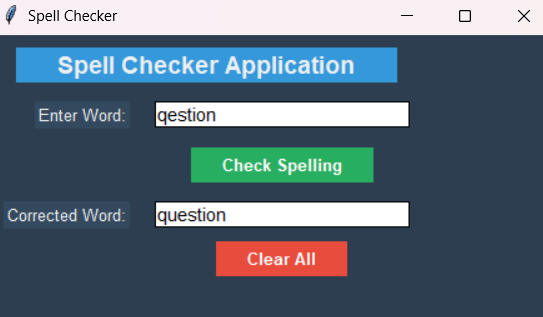

# Spell Checker Application

A simple GUI-based spell checker built with Python's Tkinter and TextBlob library.

## Screenshot



## Features

- Real-time spell correction using TextBlob
- Clean, modern user interface
- Input and output text fields
- Clear functionality to reset fields
- Cross-platform compatibility

## Requirements

- Python 3.x
- tkinter (if not installed)
- textblob

## Installation

1. Clone this repository:
   
```
git clone https://github.com/yourusername/spell-checker.git
cd spell-checker
```

2. Install required dependencies:
   
```
pip install textblob
```

3. Download TextBlob corpora (first time only):
   
```
python -m textblob.download_corpora
```

## Usage

Run the application:

```
python spell_checker.py
```

1. Enter a word or sentence in the input field
2. Click "Check Spelling" to get corrections
3. Use "Clear All" to reset both fields

## How It Works

The application uses TextBlob's natural language processing capabilities to analyze input text and suggest corrections based on common English word patterns and dictionary lookups.
